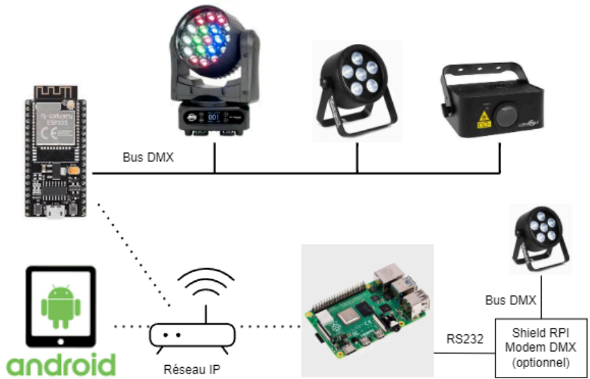
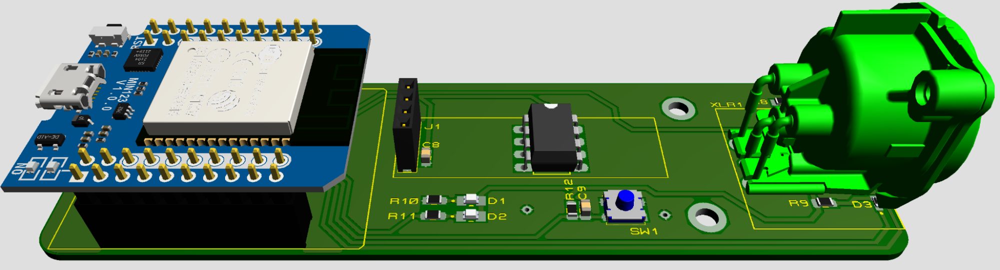
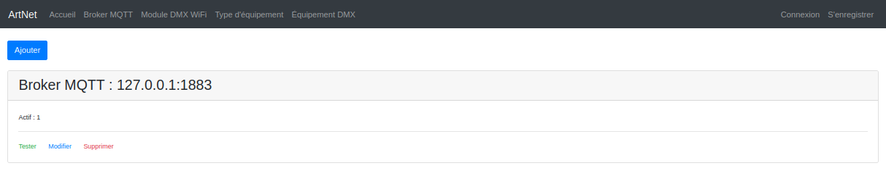
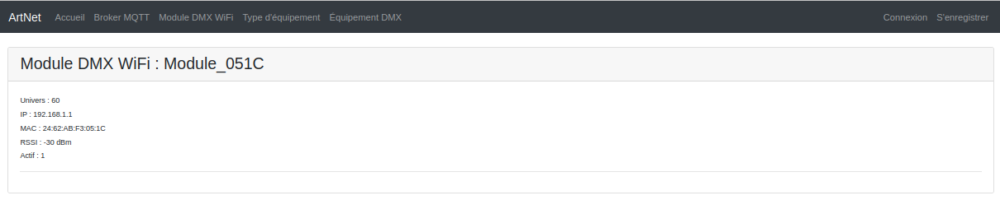
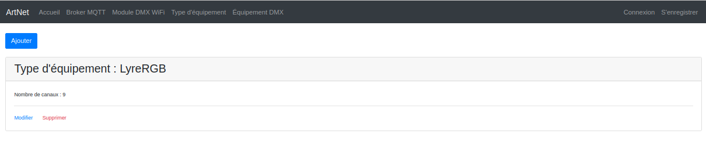
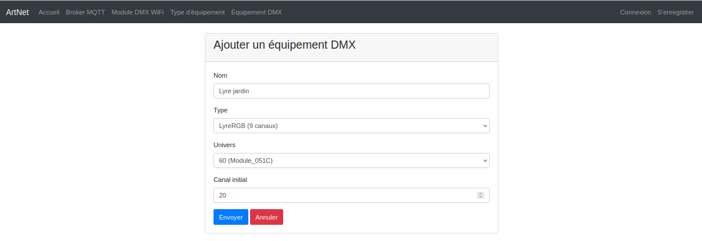
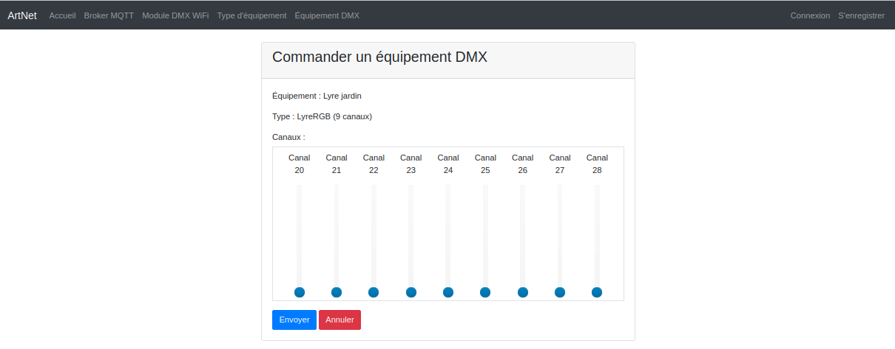
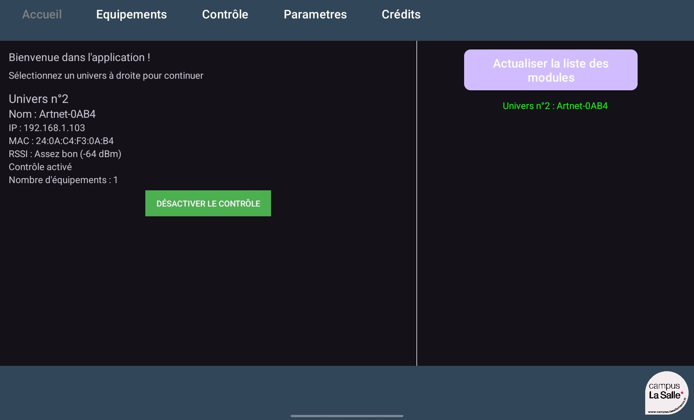
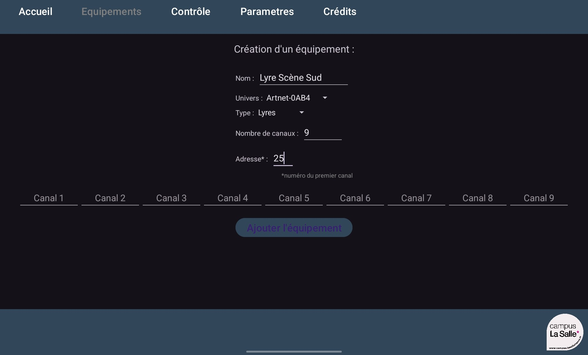
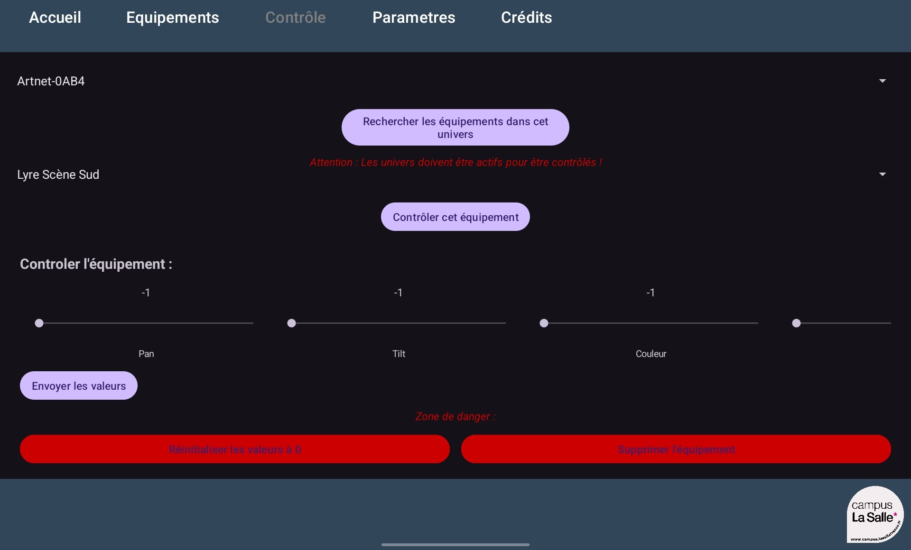

[](https://github.com/bts-lasalle-avignon-projets/artnet-2025/actions/workflows/clang-format.yml)
[](https://github.com/bts-lasalle-avignon-projets/artnet-2025/actions/workflows/androidBuild.yml)
[](https://github.com/bts-lasalle-avignon-projets/artnet-2025/actions/workflows/php-artnet.yml) [](https://github.com/bts-lasalle-avignon-projets/artnet-2025/releases)

#  Projet BTS CIEL 2025 : Artnet 2025

- [ Projet BTS CIEL 2025 : Artnet 2025](#-projet-bts-ciel-2025--artnet-2025)
  - [Présentation](#présentation)
  - [IHM](#ihm)
    - [Module Serveur](#module-serveur)
    - [Module Application de commande](#module-application-de-commande)
  - [Gestion de projet](#gestion-de-projet)
    - [Itération 1](#itération-1)
    - [Itération 2](#itération-2)
    - [Itération 3](#itération-3)
  - [Diagrammes](#diagrammes)
    - [Diagrammes des cas d'utilisations](#diagrammes-des-cas-dutilisations)
    - [Diagrammes de séquence](#diagrammes-de-séquence)
    - [Diagrammes de classes](#diagrammes-de-classes)
    - [Base de données](#base-de-données)
  - [MQTT](#mqtt)
    - [Installation du broker](#installation-du-broker)
    - [Protocole](#protocole)
  - [Tests de validation](#tests-de-validation)
    - [Module Serveur](#module-serveur-1)
    - [Module Application de commande](#module-application-de-commande-1)
  - [Equipe de développement](#equipe-de-développement)

---

## Présentation

De nos jours, les DJ et animateurs de soirée utilisent couramment un ordinateur portable à la fois pour diffuser la musique et pour gérer les différents jeux de lumières pour éclairer et animer la piste de spectacle (danse, podium, scène, ...).

Nous souhaitons mettre en avant les possibilités offertes par notre système d’éclairage de scènes automatisé.

Il s’agit donc d’intégrer dans des univers DMX composés d’éléments tel que :

- des scanners
- des PARS
- des lyres
- des Laser
- des spots spécifiques

Objectif : réaliser un système de supervision et de commande de l’ensemble de ces appareils compatibles avec un bus standard du spectacle (DMX 512).



Le système est composé de :

- Un module **Serveur** qui est le centre du système. Il héberge l’IHM d’administration technique et contient la base de données. Il est chargé de la communication avec les modules “Wifi-DMX” et l’application mobile de contrôle. Il pourra éventuellement contrôler un modem DMX filaire mais aussi stocker et gérer des constitutions de scènes pré enregistrées.

- Un module **Application de commande** qui sera l’interface utilisateur du systèmesur appareil mobile. Il permet au technicien de paramétrer et enregistrer les différents équipements DMX et les canaux associés à partir de leur adresse DMX, modifier la valeur des canaux associés aux équipements manuellement et éventuellement de programmer des situations pré enregistrés contenant les valeurs de différents canaux pour effectuer des changements complexes en un clic.

- Un (ou plusieurs) module **Wifi-DMX** qui récupére les informations émises par les modules Serveur et/ou Application de commande et les transfére au bus DMX pour commander les différents éclairages.



La communication entre les modules est basée sur MQTT (_Message Queuing Telemetry Transport_). Le module Serveur héberge un _broker_ MQTT.

## IHM

### Module Serveur

- Gérer un broker :



- Liste des modules :



- Gérer un type d'équipement DMX :



- Création d'un équipement DMX :



- Gérer un équipement DMX :


- Contrôle d'un équipement DMX :



### Module Application de commande

- Sélection d'un univers :



- Création d'un équipement DMX :



- Contrôle d'un équipement DMX :



## Gestion de projet

[GitHub Project](https://github.com/orgs/bts-lasalle-avignon-projets/projects/26)

### Itération 1

*Du 29 janvier au 28 mars*

- **Dialogue application/serveur :** Etablir une connexion etre l'application mobile et le serveur
- **Etablir la connexion avec les modules :** Associer et établir la communication avec les modules DMX
- **Activer/Désactiver un module :** Permettre l’activation ou la désactivation d’un module DMX
- **Configurer les équipements DMX et enregistrer les configurations :** : Définir les paramètres des équipements DMX et sauvegarder leurs configurations.

### Itération 2

*Du 29 mars au 23 mai*

- **Gérer la configuration technique du système via une IHM :** Fournir une interface utilsateur d'administration
- **Sauvegarder, exporter, importer l'état de configuration du système** : Permettre la gestion avancée des configurations enregistrées.
- **Créer et gérer des pré-enregistrement de valeurs de canaux :** Mise en place de scène pré-enregistrées

### Itération 3

*Du 24 mai au 30 mai*

- **Mettre en forme l'affichage :** Mise en forme responsive à 100% 
- **Prendre en charge et communiquer avec un modem DMX Filaire** : Ajouter la compatibilité avec un modem DMX filaire

## Diagrammes

### Diagrammes des cas d'utilisations

Module Serveur :


Module Application de commande :


### Diagrammes de séquence

Création d'un nouveau module :


Création et configuration d'une scène :


Activer une scène :


### Diagrammes de classes

Module Serveur :


Module Application de commande :


### Base de données


cf. [artnet.sql](./sql/artnet.sql)

## MQTT

### Installation du broker

**Sur linux :**

- Installation :

```sh
$ sudo apt install mosquitto

$ systemctl status mosquitto
```

- Configuration :

```sh
$ nano /etc/mosquitto/mosquitto.conf
```

Exemple pour la phase de développement :

```conf
# écoute sur le port 1883 sur toute les interfaces réseaux (1883 port par défaut du MQTT)
listener 1883 0.0.0.0
# accepte tout les utilisateurs (si false alors configurer toutes les authentifications des clients)
allow_anonymous true
```

- Démarrage :

```sh
$ sudo systemctl start mosquitto
```

- Arrêt :

```sh
$ sudo systemctl stop mosquitto
```

- Tests :

```sh
$ sudo apt install mosquitto-clients
```

```sh
$ mosquitto_sub -h localhost -t "test"
```

```sh
$ mosquitto_pub -h localhost -t "test" -m "Hello World"
```

### Protocole

Les données enchangées en MQTT sont formatées en JSON.

Les modules Wifi-DMX envoient leur configuration sur le topic `artnet/config` :

```json
{"univers":50, "ip":"192.168.1.1", "mac":"24:62:AB:F3:05:1C","rssi":-50}
```

Les modules de commande envoi les scènes sur le topic `artnet/univers/[univers]` :

```json
{[{"canal":10, "valeur":255},{"canal":11, "valeur":10},{"canal":12, "valeur":55}]}
```

## Tests de validation

### Module Serveur

| Désignation | Démarche à suivre | Résultat obtenu | Fonctionnel | Remarques |
| :---: | :---: | :---: | :---: | :---: |
| Gérer un broker | Sur la page “Broker MQTT”, vous pouvez ajouter, modifier ou supprimer un équipement. | Le broker et ajouter, modifier ou supprimer de la base de données. | Oui |  |
| Tester un broker | Sur la page “Broker MQTT”, aller sur tester le broker. Puis choisissez le test que vous voulez.  | Test la connectivité, la publication ainsi que la souscription et la réception du broker. | Oui | Le bouton “Souscrire”, souscrit uniquement au topic, rien d’autre. Le bouton “Recevoir” reçoit la publication d’un topic dans les 10s suivant le clic |
| Module DMX WiFi | Sur la page “Module DMX WiFi”. | Les différents modules s'affichent. | Oui | S’abonne au topic artnet/config pour recevoir les derniers modules. |
| Gérer un type d’équipement | Sur la page “Type d’équipement”, vous pouvez ajouter, modifier ou supprimer un équipement. | Le type d’équipement et ajouter, modifier ou supprimer de la base de données. | Oui |  |
| Gérer un équipement DMX | Sur la page “Équipement DMX”, vous pouvez ajouter, modifier ou supprimer un équipement. | L’équipement et ajouter, modifier ou supprimer de la base de données. | Oui |  |
| Commander un équipement DMX | Sur la page “Équipement DMX”, aller sur Commander. Changer les valeurs des sliders, puis envoyer. | L’équipement sélectionné à reçu les nouvelles valeurs des canaux, qui met à jour son état en conséquence. | Oui |  |

### Module Application de commande

| Désignation | Démarche à suivre | Résultat obtenu | Fonctionnel | Remarques |
| :---: | :---: | :---: | :---: | :---: |
| Ajout d’un nouveau module | Démarrer l’application et attendre qu’un module connecté envoie un message | Apparition du module en cliquant sur le bouton “Actualiser la liste des modules” | Oui |  |
| Création d’un équipement | Sur la page “Equipements”, entrer le nom, sélectionner l’univers, le type d’équipement, le nombre de canaux, l’adresse et optionnellement la définition des canaux | Nouvel équipement créé. | Oui |  |
| Contrôle d’un équipement | Sélectionner un univers, puis un équipement, modifier la valeur des canaux puis appuyer sur le bouton “Envoyer les valeurs” | L’équipement sélectionné à reçu les nouvelles valeurs des canaux, qui met à jour son état en conséquence. | Oui |  |
| Supprimer un équipement | Sur la page “Contrôle”, sélectionner l’univers puis l’équipement. Cliquer sur le bouton “Supprimer l’équipement” | L’équipement n’existe plus dans l’application. | Oui |  |
| Réinitialiser à 0 l’équipement | Sélectionner un univers, puis un équipement, puis cliquer sur le bouton “Réinitialiser les valeurs à 0”. | L’équipement est éteint/retourné à sa position initiale. | Oui |  |

## Equipe de développement

- Module Application de commande (Android) : [Aymeric CLEMENT](aymeric.clement.pro@gmail.com)
- Module Serveur (PHP) : [Dylan VAUDAINE](dylan.vaudaine.pro@gmail.com)

---
&copy; 2025 LaSalle Avignon
