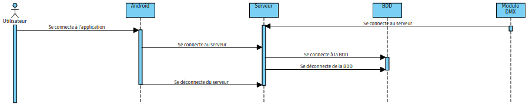

# Projet Artnet 2025 

---

- [Projet Artnet 2025](#projet-artnet-2025)
    - [Introduction](#introduction)
        - [Informations](#informations)
        - [Présentation](#présentation)
    - [Diagrammes](#diagrammes)
        - [Diagramme des cas d'utilisations](#diagramme-des-cas-dutilisations)
        - [Diagramme de séquence](#diagramme-de-séquence)
        - [Diagramme des blocs internes](#diagramme-des-blocs-internes)
        - [Diagramme des classes](#diagramme-des-classes)
        - [Base de donnée](#base-de-donnée)
    - [Utilisations](#utilisation)
    - [Itérations](#itérations)
        - [Itération 1](#itération-1)
        - [Itération 2](#itération-2)
        - [Itération 3](#itération-3)
    - [Protocole](#protocole)
    - [Changelog](#changelog)
    - [Défauts constatés non corrigés](#défauts-constatés-non-corrigés)
    - [Equipe de développement](#equipe-développement)

---

## Introduction

### Informations

- Nom du projet : ARTNET
- Date de début : Février 2025
- Version : --

### Présentation

De nos jours, les DJ et animateurs de soirée utilisent couramment un ordinateur portable à la fois pour diffuser la musique et pour gérer les différents jeux de lumières pour éclairer et animer la piste de spectacle (danse, podium, scène, ...).
Nous souhaitons mettre en avant les possibilités offertes par notre système d’éclairage de scènes automatisé.

Il s’agit donc d’intégrer dans des univers DMX composés d’ éléments tel que :
- des scanners
- des PARS
- des lyres
- des Laser
- des spots spécifiques

De réaliser un système de supervision et de commande de l’ensemble de ces appareils compatibles avec un bus standard du spectacle (DMX 512).

Le système est composé de :

- Un module **Serveur** qui est le centre du système. Il héberge l’IHM d’administration technique et contient la base de données. 
Il est chargé de la communication avec les modules “Wifi-DMX” et l’application mobile de contrôle. 
Il pourra éventuellement contrôler un modem DMX filaire mais aussi stocker et gérer des constitutions de scènes pré enregistrées.

- Un module **Application de commande** qui sera l’interface utilisateur du systèmesur appareil mobile. 
Il permet au technicien de paramétrer et enregistrer les différents équipements DMX et les canaux associés à partir de leur adresse DMX, modifier la valeur des canaux associés aux équipements manuellement et éventuellement de programmer des situations pré enregistrés contenant les valeurs de différents canaux pour effectuer des changements complexes en un clic.

## Utilisation

## Itérations

### Itération 1

### Itération 2

### Itération 3 

## Diagrammes

### Diagramme des cas d'utilisations

Diagramme du serveur :

Diagramme de l'application mobile :

### Diagramme de séquence

Connexion à la BDD :

Création et configuration d'une scène :

Activer une scène :

### Diagramme des classes

Diagramme du serveur :

Diagramme de l'application mobile :

### Base de donnée

## Protocole

Nous utilisons le protocole MQTT pour communiquer entre le serveur et chaque boîtier Wifi-DMX
Le protocole MQTT à pour "blocker" le serveur avec l'IHM d'administration, chaque boîtier va se souscrire à un Topic, lorsqu'un message sera envoyée sur le serveur, si le boîtier à pour Topic l'en-tête du message, il lira les données. Sinon, il les laissera.

Le boîtier créé pour le test aura pour Topic "Scene/Principal"

Quand on veut envoyer un message avec des informations, il faut donc utiliser le topic :
"ARTNET/Scene/Principal", ensuite nous pouvons envoyer le message que l'on souhaite sur ce boîtier

## Changelog

## Défauts constatés non corrigés

## Equipe développement

- ÉTUDIANT IR 1 : [Aymeric CLEMENT](aymeric.clement.pro@gmail.com)
- ÉTUDIANT IR 2 : [Dylan VAUDAINE](dylan.vaudaine.pro@gmail.com)

--- 

&copy; 2025 LaSalle Avignon