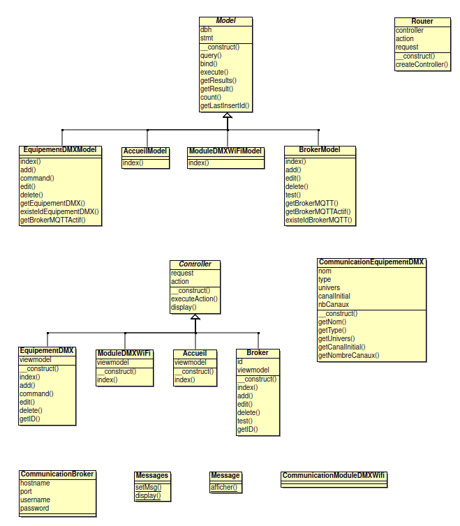

#  Projet Artnet 2025 

---

- [ Projet Artnet 2025](#-projet-artnet-2025)
  - [Introduction](#introduction)
    - [Informations](#informations)
    - [Présentation](#présentation)
  - [Utilisation](#utilisation)
    - [Broker MQTT](#broker-mqtt)
  - [Itérations](#itérations)
    - [Itération 1](#itération-1)
    - [Itération 2](#itération-2)
    - [Itération 3](#itération-3)
  - [Diagrammes](#diagrammes)
    - [Diagramme des cas d'utilisations](#diagramme-des-cas-dutilisations)
    - [Diagramme de séquence](#diagramme-de-séquence)
    - [Diagramme de classes](#diagramme-de-classes)
    - [Base de données](#base-de-données)
  - [Protocole](#protocole)
  - [Changelog](#changelog)
  - [Défauts constatés non corrigés](#défauts-constatés-non-corrigés)
  - [Equipe développement](#equipe-développement)

---

## Introduction

### Informations

- Nom du projet : ARTNET
- Date de début : 25 Février 2025
- Version : --

### Présentation

De nos jours, les DJ et animateurs de soirée utilisent couramment un ordinateur portable à la fois pour diffuser la musique et pour gérer les différents jeux de lumières pour éclairer et animer la piste de spectacle (danse, podium, scène, ...).
Nous souhaitons mettre en avant les possibilités offertes par notre système d’éclairage de scènes automatisé.

Il s’agit donc d’intégrer dans des univers DMX composés d’ éléments tel que :

- des scanners
- des PARS
- des lyres
- des Laser
- des spots spécifiques

De réaliser un système de supervision et de commande de l’ensemble de ces appareils compatibles avec un bus standard du spectacle (DMX 512).

Le système est composé de :

- Un module **Serveur** qui est le centre du système. Il héberge l’IHM d’administration technique et contient la base de données. Il est chargé de la communication avec les modules “Wifi-DMX” et l’application mobile de contrôle. Il pourra éventuellement contrôler un modem DMX filaire mais aussi stocker et gérer des constitutions de scènes pré enregistrées.

- Un module **Application de commande** qui sera l’interface utilisateur du systèmesur appareil mobile. Il permet au technicien de paramétrer et enregistrer les différents équipements DMX et les canaux associés à partir de leur adresse DMX, modifier la valeur des canaux associés aux équipements manuellement et éventuellement de programmer des situations pré enregistrés contenant les valeurs de différents canaux pour effectuer des changements complexes en un clic.

## Utilisation

### Broker MQTT

**Sur linux :**

- Installation :

```sh
$ sudo apt install mosquitto

$ systemctl status mosquitto
```

- Configuration :

```sh
$ nano /etc/mosquitto/mosquitto.conf
```

Exemple, pour la phase de développement :

```conf
# écoute sur le port 1883 sur toute les interfaces réseaux (1883 port par défaut du MQTT)
listener 1883 0.0.0.0
# accepte tout les utilisateurs (si false alors configurer toutes les authentifications des clients)
allow_anonymous true
```

- Démarrage :

```sh
$ sudo systemctl start mosquitto
```

- Arrêt :

```sh
$ sudo systemctl stop mosquitto
```

- Tests :


## Itérations

### Itération 1

*Du 29 janvier au 28 mars*

- **Dialogue application/serveur :** Etablir une connexion etre l'application mobile et le serveur
- **Etablir la connexion avec les modules :** Associer et établir la communication avec les modules DMX
- **Activer/Désactiver un module :** Permettre l’activation ou la désactivation d’un module DMX
- **Configurer les équipements DMX et enregistrer les configurations :** : Définir les paramètres des équipements DMX et sauvegarder leurs configurations.

### Itération 2

*Du 29 mars au 23 mai*

- **Gérer la configuration technique du système via une IHM :** Fournir une interface utilsateur d'administration
- **Sauvegarder, exporter, importer l'état de configuration du système** : Permettre la gestion avancée des configurations enregistrées.
- **Créer et gérer des pré-enregistrement de valeurs de canaux :** Mise en place de scène pré-enregistrées

### Itération 3

*Du 24 mai au 30 mai*

- **Mettre en forme l'affichage :** Mise en forme responsive à 100% 
- **Prendre en charge et communiquer avec un modem DMX Filaire** : Ajouter la compatibilité avec un modem DMX filaire


## Diagrammes

### Diagramme des cas d'utilisations

Diagramme du serveur :


Diagramme de l'application mobile :


### Diagramme de séquence

Création d'un nouveau module


Création et configuration d'une scène :


Activer une scène :


### Diagramme de classes

Diagramme du serveur :



Diagramme de l'application mobile :


### Base de données


## Protocole

Nous utilisons le protocole MQTT pour communiquer entre l'application, le serveur et chaque boîtier Wifi-DMX.


## Changelog


## Défauts constatés non corrigés

## Equipe développement

- ÉTUDIANT IR 1 : [Aymeric CLEMENT](aymeric.clement.pro@gmail.com)
- ÉTUDIANT IR 2 : [Dylan VAUDAINE](dylan.vaudaine.pro@gmail.com)

--- 

&copy; 2025 LaSalle Avignon